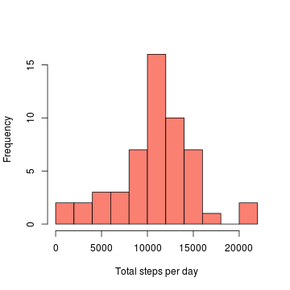
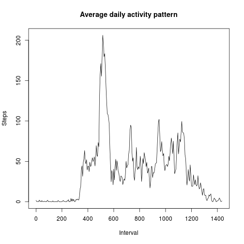
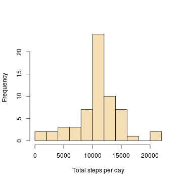
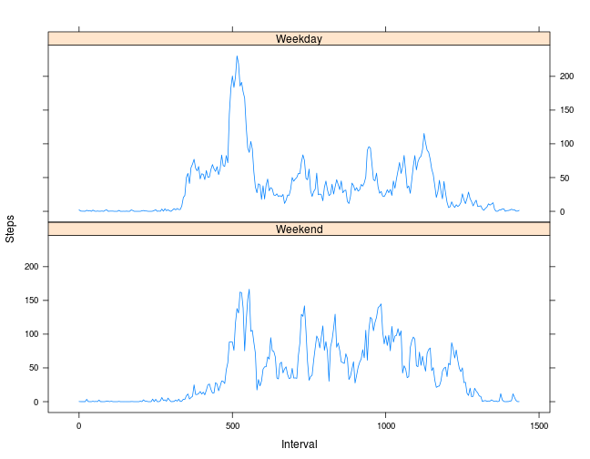

***


## Loading and preprocessing the data  


```r
file <- unz("activity.zip", "activity.csv")
mydata <- read.csv(file, na.strings = "NA", comment.char = "",
                   colClasses = c("numeric", "character", "numeric"))

## process and transform data
mydata <- within(mydata, {
    date <- as.Date(date)   # coerce date
    
    # convert interval to elapsed seconds since midnight
    interval <- interval - (interval %/% 100) * 40

    # add day to indicate whether weekday/weekend
    day <- factor(weekdays(date) %in% c("Saturday", "Sunday"), 
                  levels = c(T, F), labels = c("Weekend", "Weekday"))
})

head(mydata)
```

```
##   steps       date interval     day
## 1    NA 2012-10-01        0 Weekday
## 2    NA 2012-10-01        5 Weekday
## 3    NA 2012-10-01       10 Weekday
## 4    NA 2012-10-01       15 Weekday
## 5    NA 2012-10-01       20 Weekday
## 6    NA 2012-10-01       25 Weekday
```

*__Interval__ is converted to seconds elapsed since midnight 
on the corresponding day*  
*New column __Day__ is added to indicate whether the day 
is a weekday or weekend*


***


## Total number of steps taken per day  


### Estimates


```r
totalStepsPerDay <- aggregate(steps ~ date, mydata, sum)$steps
mean.totalStepsPerDay <- mean(totalStepsPerDay)
median.totalStepsPerDay <- median(totalStepsPerDay)
```

Mean of total steps per day is __10766.19__  
Median of total steps day is __10765__


### Distribution


```r
hist(totalStepsPerDay, breaks = 10, col = "salmon", 
     xlab = "Total steps per day", main = NULL)
```

 


***


## Average daily activity pattern


### Highest activity interval


```r
activity <- aggregate(steps ~ interval, mydata, mean)
maxActivityInterval <- with(activity, interval[which.max(steps)])
maxActivityInterval
```

```
## [1] 515
```

*Note: Units in secs after midnight*  
 

### Time series plot


```r
plot(activity, type = "l", xlab = "Interval", ylab = "Steps", 
     main = "Average daily activity pattern")
```

 


***


## Imputing missing values


```r
nrMissingVals <- sum(is.na(mydata$steps))
```

Number of missing values in the dataset = __2304__


### Strategy

The NAs in the dataset are first replaced with the mean steps for that day.
If there exists any remaining NAs they are replaced with the mean steps for
that interval. The second step handles a *very odd scenario* in which
no values exist on a particular day, i.e. its mean steps = NA on that day.


```r
imputedData <- within(mydata, {
    # replace NAs with mean steps for that day
    steps <- tapply(steps, date, 
                    function(x) { x[is.na(x)] <- mean(x, na.rm = T); x })
    steps <- unsplit(steps, date)
    
    # replace remaining NAs with mean steps for that interval
    steps <- tapply(steps, interval, 
                    function(x) { x[is.na(x)] <- mean(x, na.rm = T); x })
    steps <- unsplit(steps, interval)
})
```


### Impact on total steps taken per day


#### Estimates


```r
totalStepsPerDay.imputed <- aggregate(steps ~ date, imputedData, sum)$steps
mean.totalStepsPerDay.imputed <- mean(totalStepsPerDay.imputed)
median.totalStepsPerDay.imputed <- median(totalStepsPerDay.imputed)
```

Mean total steps per day is __10766.19__  
Median total steps per day is __10766.19__  


#### Distribution


```r
hist(totalStepsPerDay.imputed, breaks = 10, col = "wheat",
     xlab = "Total steps per day", main = NULL)
```

 


#### Summary statistics comparison


```r
summary(totalStepsPerDay, digits = 12)      # before imputing
```

```
##     Min.  1st Qu.   Median     Mean  3rd Qu.     Max. 
##    41.00  8841.00 10765.00 10766.19 13294.00 21194.00
```

```r
summary(totalStepsPerDay.imputed, digits = 12)      # after imputing
```

```
##     Min.  1st Qu.   Median     Mean  3rd Qu.     Max. 
##    41.00  9819.00 10766.19 10766.19 12811.00 21194.00
```


***


## Activity patterns between weekdays and weekends


```r
timeSeriesData <- aggregate(steps ~ interval + day, imputedData, mean)
xyplot(steps ~ interval | day, data = timeSeriesData, type = "l",
       layout = c(1, 2), xlab = "Interval", ylab = "Steps")
```

 
       
       
       
       
